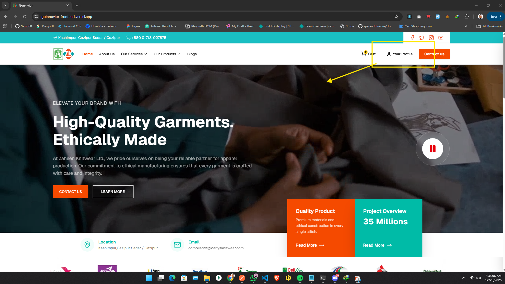
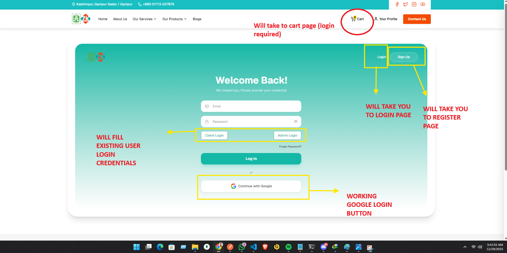
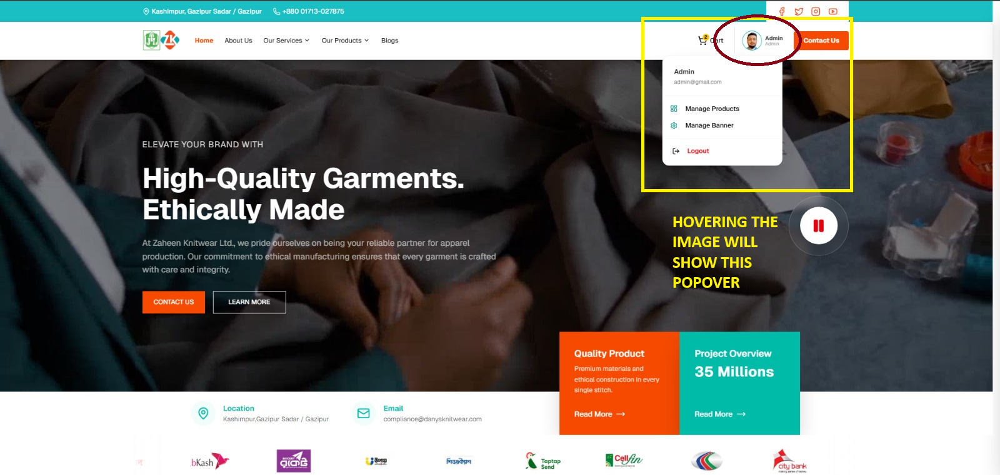

# Gonnivior E-Commerce Frontend

A robust, modular e-commerce frontend built with **Next.js 16.0.7**, **React 19.2.0**, **Shadcn/UI**,  **Typescript** and **Tailwind CSS 4**. This project demonstrates modular product and banner management, authentication, cart functionality with localStorage, and a clean, responsive UI. Authentication is handled via JWT tokens stored in cookies, with secure admin routes. Auth Guard ensures only authorized users can access user specific pages any violations redirect to login page. All error are handled gracefully with custom error pages and toast notifications.

---


### Live Link : [Gonnivior E-Commerce Frontend](https://gonnivior-frontend.vercel.app/)
### Backend Repo : [Gonnivior E-Commerce Backend](https://github.com/Sazid60/Goinnovior-Backend.git)


#### Admin Login Credential

- ADMIN_EMAIL= admin@gmail.com
- ADMIN_PASSWORD= Admin@12345

**Special Notes :**
1. Hit the `Your Profile` button on the navbar to access login page and can navigate from login page to register page. After successful login hover over your image in the navbar and see user dropdown with logout option.
2. Once You log in you will not be able to access the auth routes (login, register) unless you log out.
3. Add to cart functionality is dealt with local storage. So, the cart items will persist even after page refresh.
4. The dynamic contents are `Banner Content` , `products` which can be managed from the admin panel.

*visual representations are given at the end of the README*

## Features Overview

### Product Management (Admin)

- **List, Create, Update, Delete Products**:
  - Admins can add, update, and delete products using accessible modal dialogs.
  - Product forms use Zod validation for all fields (name, description, price, quantity, image) and provide instant error feedback.
  - Image upload supports file type and size validation, with preview and reset options.
  - Pagination  supported for large product lists, with meta info and page navigation.
  - All product actions have robust error handling with toast notifications and custom error pages for server/client errors.
  - Product CRUD operations trigger UI updates and cache revalidation for a seamless admin experience.
- **AdminCard**:
  - Product cards for admin show all product details, including name, description, price range, quantity, and image.
  - Quick actions: update (opens pre-filled dialog), delete (confirmation dialog), view, and share.
  - Stock status is visually highlighted for inventory management.
  - All actions are accessible and keyboard-navigable.

### Banner Management (Admin)

- **View & Update Homepage Banner**:
  - Admin can view and update the homepage banner, including video, title, description, email, and phone/location.
  - Banner update uses a modal dialog with Zod validation for all fields and file size/type checks for video uploads.
  - Video preview is shown before upload, and the banner is updated live on save.
  - Banner video is set to autoplay, loop, and is muted by default for UX and accessibility.
  - All errors (validation, upload, server) are handled with toast notifications and error pages.

### Authentication & Auth Guard

- **Login/Register**:
  - Login and register forms use Zod validation for all fields (email, password, name, contact, profile photo) and show inline errors.
  - Demo login buttons autofill credentials for admin and client roles for quick testing.
  - Google OAuth login is supported, with loading state and error handling.
  - Auth state is managed via secure JWT tokens in cookies and React context, supporting SSR and client navigation.
  - All authentication errors (invalid credentials, server issues) are shown with toast notifications and custom error pages.
- **Register**:
  - New users can register with name, email, password, contact number, and optional profile photo.
  - Profile photo upload supports file validation and preview.
  - Registration triggers automatic login and redirects to the appropriate dashboard.
- **Auth Guard**:
  - All protected/admin/user pages are guarded. Unauthorized access redirects to the login page.
  - Auth Guard checks JWT validity and user role before rendering protected content.
  - Unauthorized or expired sessions are handled gracefully with redirects and error toasts.
  - All authentication and authorization errors are handled gracefully with custom error pages and toast notifications.

## Protected Pages

The following pages are protected and require authentication (and appropriate role, if admin):

- `/admin/manage-products` – Only accessible by admin users for product management (CRUD).
- `/admin/manage-banner` – Only accessible by admin users for banner management.
- Any future `/admin/*` or user-specific dashboard pages will also be protected.
- `/cart` – Accessible by authenticated users to view and manage their cart.

### Cart System (Client)

- **Add/Remove Products**:
  - Users can add products to cart from any product card; if already in cart, the button is disabled and a toast is shown.
  - Remove from cart is available on the cart page, with instant UI update and toast feedback.
  - Cart state is managed globally with React Context API and persisted in localStorage for session continuity.
  - Cart badge in the navbar updates live and is hydration-safe (avoids SSR mismatch).
  - Cart supports quantity and price display for each item.
- **Cart Page**:
  - Shows all cart items as cards, matching the product card UI, but with a remove button instead of add.
  - "Buy Now" button is available for each cart item (future integration point for checkout).
  - Empty cart state is visually distinct and user-friendly.
  - All cart actions are accessible and provide instant feedback.

### User Interface & Experience

- **Responsive Design**:
  - Fully responsive layout using Tailwind CSS 4, shadcn/ui, and custom themes for light/dark mode.
  - Mobile-first design with adaptive grids, spacing, and navigation.
- **Accessible Components**:
  - All dialogs, forms, and cards are keyboard-navigable and screen-reader friendly.
  - Uses semantic HTML and ARIA attributes for accessibility.
- **Toast Notifications**:
  - Sonner provides instant, context-aware feedback for all user actions (success, error, info).
  - Toasts are used for validation errors, server errors, and successful actions.
- **Loading & Error States**:
  - Custom error and not-found pages for all routes, with friendly messaging and navigation options.
  - Loading spinners and skeletons are used for async data and page transitions.
  - All errors (client/server/network) are handled gracefully and never block navigation.

### Home Page

- **Hero Banner**:
  - Dynamic hero section with autoplaying, looping, and muted video background.
  - Banner details (title, description, contact) are fetched from the backend and editable by admin.
  - Play/pause controls for video, with accessibility support.
- **Facilities Section**:
  - Visual step-by-step display of the production process, each with icon, title, and description.
  - Responsive grid adapts to all screen sizes.
- **Featured Products**:
  - Highlights top products with product cards, add to cart, and buy now actions.
  - Handles empty state and loading gracefully.
- **Marquee**:
  - Animated text bar for announcements or promotions, fully responsive and accessible.

### Shared Layouts & Navigation

- **Public & Admin Layouts**:
  - All pages use shared layouts for consistent navigation, theming, and footer.
  - NavWrapper and PublicNavbar handle user state, cart badge, and role-based links.
  - ThemeProvider enables light/dark mode and system preference.
- **User Dropdown**:
  - Shows user info, role, and logout option in a dropdown menu.
  - Dropdown is accessible and closes on outside click or escape.

---

## Pages & Flows

- `/` (Home): Hero, Marquee, Facilities, Featured Products.
- `/login`: Login form, demo login, Google OAuth.
- `/register`: Register form, profile photo, Google OAuth.
- `/cart`: Cart items, remove/buy, empty state (protected page).
- `/admin/manage-products`: Product CRUD, pagination, dialogs.
- `/admin/manage-banner`: Banner preview and update.
- `/not-found`, `/error`: Custom error handling.

---

## Validation & Security

- **Zod Validation**: All forms (product, banner, auth) use Zod schemas for strict validation.
- **File Uploads**: Image/video uploads with type and size checks.
- **JWT Auth**: Secure login, register, and protected admin routes.

---

## Folder Structure

```
components/
  modules/         # Feature modules (Home, Admin, etc.)
  shared/          # Shared UI components (Navbar, Footer, etc.)
  ui/              # UI primitives (Button, Input, etc.)
context/           # React Contexts (CartContext)
lib/               # Utility functions (fetch, validation, etc.)
services/          # API service functions (auth, product, banner)
types/             # TypeScript interfaces and types
zod/               # Zod validation schemas
public/            # Static assets (images, icons, video)
src/app/           # Next.js app directory (layouts, pages, styles)
```

---

## Getting Started

1. **Install dependencies:**

   ```bash
   npm install
   ```

2. **Set up environment variables:**

   ```ts
   NEXT_PUBLIC_BASE_API_URL=
   NODE_ENV=development
   JWT_SECRET=
   REFRESH_TOKEN_SECRET=
   RESET_PASS_TOKEN=
   NEXT_PUBLIC_BUILDER_API_KEY=
   ```

3. **Run the development server:**

   ```bash
   npm run dev
   ```

4. **Build for production:**
   ```bash
   npm run build
   npm start
   ```

---

## Scripts

- `npm run dev` – Start the development server
- `npm run build` – Build for production
- `npm start` – Start the production server
- `npm run lint` – Lint the codebase

---


## SOME VISUAL INSTRUCTIONS IF YOU FEEL LOST





